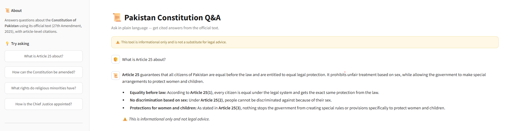

<div align="center">

# 📜 Pakistan Constitution Q&A Assistant

### A RAG-powered chatbot that answers Constitution of Pakistan questions with accurate article-level citations

[](https://pak-constitution-bot.streamlit.app/)
[](https://github.com/AbdullahQ-AI/pakistan-constitution-rag-assistant)


</div>

---

## 🚀 Overview

A Retrieval-Augmented Generation (RAG) system that lets anyone ask plain-language questions about the **Constitution of Pakistan** and get accurate, article-cited answers — built entirely with free, open-source tools, no paid APIs.

<div align="center">




</div>

## ✨ Features

- ✅ Answers using **only** the official Constitution text — no hallucinated legal claims
- ✅ Every answer cites the specific **Article number(s)** it's based on
- ✅ **Hybrid retrieval**: direct article lookup + semantic search + keyword search
- ✅ Gracefully declines off-topic questions instead of guessing
- ✅ Clean, minimal chat UI with example-question shortcuts

## 🛠️ Tech Stack

<div align="center">

| Component | Tool | Why |
|:---:|:---:|:---|
| 📄 PDF Parsing | `PyMuPDF` | Cleaner text extraction than `pypdf` for this document's fonts |
| 🧬 Embeddings | `sentence-transformers` (MiniLM-L6-v2) | Runs **locally** — zero API cost |
| 🔍 Vector Store | `FAISS` (local) | Free, fast similarity search |
| 🤖 LLM | `Google Gemini` (free tier) | No credit card required |
| 💬 UI | `Streamlit` | Free hosting on Community Cloud |

</div>

## 🧩 How It Works

```
PDF → Clean Text → Chunk + Index → Retrieve → Gemini → Cited Answer
```

1. **Ingestion** (`src/ingest.py`) — parses the PDF, strips footnote noise, and builds:
   - a FAISS vector index for semantic search
   - a direct article-number lookup table
   - a full-page text index (avoids losing context at chunk boundaries)
2. **Retrieval** (`src/qa_chain.py`) — direct lookup for specific articles, or hybrid semantic + keyword search for conceptual questions
3. **Generation** — retrieved context + a citation-enforcing system prompt → Gemini
4. **UI** (`src/app.py`) — Streamlit chat interface

## 🐛 Challenges & How They Were Solved

Building this surfaced several non-obvious real-world RAG problems:

| Problem | Fix |
|---|---|
| `pypdf` mangled word spacing ("A rticle") | Switched to PyMuPDF for cleaner extraction |
| Footnotes ("Subs. by Amdt...") polluting semantic search | Regex-filtered footnote lines during ingestion |
| Table-of-Contents pages mistaken for real article text | Detected & excluded front-matter pages by footer pattern |
| Amendment brackets (`3[9A. ...]`) broke article-number detection | Updated regex to tolerate bracket prefixes |
| Answers split across chunk boundaries (e.g. PM qualifications spanning Art. 90–91) | Switched to page-level retrieval with neighboring-page expansion |
| Free-tier Gemini models kept getting deprecated mid-project | Switched to `-latest` model aliases |

📋 See [CHANGELOG.md](CHANGELOG.md) for the full development history and version-by-version fixes.

## 🧪 Testing

An automated evaluation script (`src/evaluate.py`) checks the pipeline against a fixed test set:

<div align="center">

| Test Category | Result |
|:---:|:---:|
| Citation Accuracy (15 questions) | **15/15 (100%)** |
| Off-Topic Refusal (4 questions) | **4/4 (100%)** |
| **Overall** | **19/19 (100%)** |

</div>

Test categories:
- **Direct article lookups** (Articles 9, 19, 25, 62, 175, 199...) — verifies exact citation accuracy
- **Conceptual questions** (PM qualifications, amendment process, judiciary structure) — verifies semantic + keyword retrieval
- **Off-topic / edge cases** (fake articles, unrelated topics) — verifies the system declines rather than hallucinating

Run it yourself:
```bash
python src/evaluate.py
```


## ⚡ Running Locally

```bash
git clone https://github.com/AbdullahQ-AI/pakistan-constitution-rag-assistant.git
cd pakistan-constitution-rag-assistant
python -m venv venv
venv\Scripts\activate      # Windows
pip install -r requirements.txt
```

Create a `.env` file:
```
GOOGLE_API_KEY=your_key_here
```
Get a free key at [Google AI Studio](https://aistudio.google.com/app/apikey).

```bash
python src/ingest.py
streamlit run src/app.py
```

## 📚 Data Source

Constitution of Pakistan, official text (27th Amendment, 2025) — [National Assembly of Pakistan](https://www.na.gov.pk/)

## ⚠️ Disclaimer

This tool is for informational and educational purposes only. It is **not** a substitute for professional legal advice.

---

<div align="center">

### 👤 Author

**Abdullah Qadeer** — BS Artificial Intelligence Student

[](https://github.com/AbdullahQ-AI)

<i>⭐ Star this repo if you find it useful!</i>

</div>
